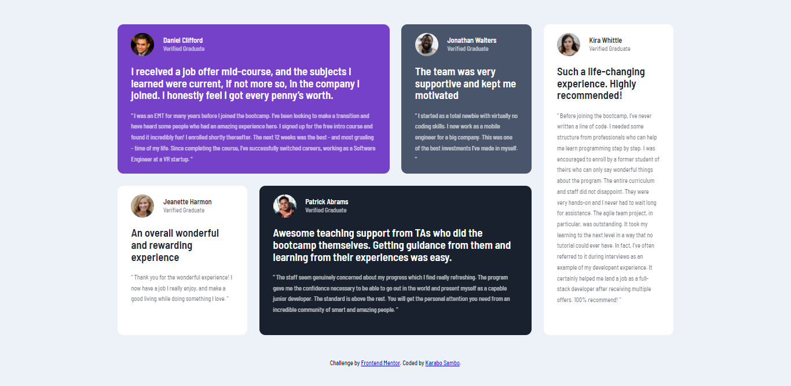

# Frontend Mentor - Testimonials grid section solution

This is a solution to the [Testimonials grid section challenge on Frontend Mentor](https://www.frontendmentor.io/challenges/testimonials-grid-section-Nnw6J7Un7). Frontend Mentor challenges help you improve your coding skills by building realistic projects. 

## Table of contents

- [Overview](#overview)
  - [The challenge](#the-challenge)
  - [Screenshot](#screenshot)
  - [Links](#links)
- [My process](#my-process)
  - [Built with](#built-with)
  - [Continued development](#continued-development)
- [Author](#author)

## Overview

### The challenge

Users should be able to:

- View the optimal layout for the section depending on their device's screen size

### Screenshot

### Links

- Solution URL: [github.com/blaqbox-prime/sunnyside-agency-landing-page](https://github.com/blaqbox-prime/testimonial-grid-section)

- Live Site URL: [Hosted on Github Pages](https://blaqbox-prime.github.io/testimonial-grid-section/)

## My process
I start off with creating color variables in the document root. Then creating the css classes for text colors and background colors. I then analyze the design and chopped it into sections then split those sections furthur into smaller content containers and start writing the css for those containers as closely as possible to the design. After going as far as I can with the styling I then write the HTML. From there everything is adjusted as the HTML is written.

I use a mobile first aproach so the mobile ui is the initial style then a media query for larger screens, 1024px+ is used to create the desktop design. 

### Built with
- CSS custom properties
- Flexbox
- Mobile-first workflow
- CSS grid

## Author

- Instagram - [@ig_blaqbox.dev](https://www.instagram.com/ig_blaqbox.dev)
- Frontend Mentor - [@blaqbox-prime](https://www.frontendmentor.io/profile/blaqbox-prime)
- github - [@blaqbox-prime](https://www.github.com/blaqbox-prime)
